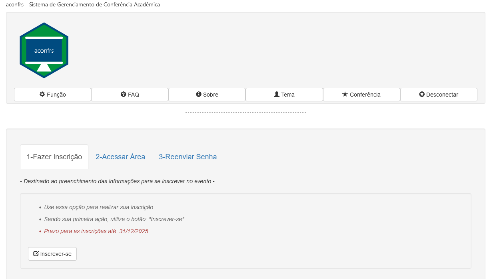

<center>


# aconfrs

### Academic Conference Management System

</center>

--- 

### aconfrs

Easy and simple application for managing small university conferences

Created in: R and shiny

For now:
- In development phase[^1]
- Not yet fully functional
- R package not implemented
- This version can be tested locally with the R command: `shiny::runGitHub('cleber-n-borges/aconfrs')` [^2]
- It is also possible to run the app via [Docker] (server:3838/aconfrs-main/): `docker pull cleber0n0borges/aconfrs` [^3]
- Take a online test immediately on the [shinyapps.io] website [^4]

[shinyapps.io]: https://quimiometria.shinyapps.io/aconfrs/

[Docker]: https://hub.docker.com/r/cleber0n0borges/aconfrs

---

### Screenshot:

- Screenshot of the Home Screen



---

### Docker

- The **aconfrs** can also be used via [Docker]
- The app responds on port 3838 (default in shiny-server)
- The app is tentatively in the `aconfrs-main` directory to undergo further testing, but will soon move to exposure on the server's top-level port
- Dockerfile available

```
FROM rocker/shiny
RUN sudo rm -r /srv/shiny-server/*
RUN sudo apt-get update
RUN sudo apt-get install -y libpoppler-cpp-dev
RUN sudo Rscript -e 'tmpf <- tempfile();\
filezip <- "https://github.com/cleber-n-borges/aconfrs/archive/refs/heads/main.zip";\
download.file(filezip, tmpf, quiet=TRUE);\
unzip(tmpf, exdir="/tmp");unlink(tmpf);'
#############################################################
RUN sudo cp -r /tmp/aconfrs-main/ /srv/shiny-server/ 
RUN sudo rm -r /tmp/*
RUN sudo chown -R shiny:shiny /srv/shiny-server/aconfrs-main/*
RUN sudo chown -R shiny:shiny /srv/shiny-server/aconfrs-main/
VOLUME /srv/shiny-server/aconfrs-main/data
#############################################################
RUN sudo Rscript -e 'install.packages("shinyjs", quiet=TRUE)'
RUN sudo Rscript -e 'install.packages("shinyvalidate", quiet=TRUE)'
RUN sudo Rscript -e 'install.packages("shinyWidgets", quiet=TRUE)'
RUN sudo Rscript -e 'install.packages("shinythemes", quiet=TRUE)'
RUN sudo Rscript -e 'install.packages("shinybrowser", quiet=TRUE)'
RUN sudo Rscript -e 'install.packages("bslib", quiet=TRUE)'
RUN sudo Rscript -e 'install.packages("sever", quiet=TRUE)'
RUN sudo Rscript -e 'install.packages("DT", quiet=TRUE)'
RUN sudo Rscript -e 'install.packages("numbersBR", quiet=TRUE)'
RUN sudo Rscript -e 'install.packages("RSQLite", quiet=TRUE)'
RUN sudo Rscript -e 'install.packages("DBI", quiet=TRUE)'
RUN sudo Rscript -e 'install.packages("blob", quiet=TRUE)'
RUN sudo Rscript -e 'install.packages("pool", quiet=TRUE)'
RUN sudo Rscript -e 'install.packages("pdftools", quiet=TRUE)'
RUN sudo Rscript -e 'install.packages("cookies", quiet=TRUE)'
RUN sudo Rscript -e 'install.packages("markdown", quiet=TRUE)'
### Verificação se houve a correta compilação de todos pacotes
RUN sudo Rscript -e 'list.of.packages <- c("shinyjs","shinyvalidate","shinyWidgets","sever","DT","DBI","numbersBR",\
"pdftools","shinythemes","blob","shinybrowser","bslib","RSQLite","pool","shinybrowser","bslib","RSQLite","cookies",\
"markdown"); lost.packages <- list.of.packages[!(list.of.packages %in% installed.packages()[,"Package"])];\
cat(paste0("\n\n\n*** Pacotes perdidos: ", length(lost.packages), " : ", lost.packages,  " ***\n\n\n"))'
```


[^1]: Project started in mid-2023 
[^2]: GitHub: https://github.com/cleber-n-borges/aconfrs
[^3]: DockerHub: https://hub.docker.com/u/cleber0n0borges
[^4]: shinyapps.io: https://quimiometria.shinyapps.io/aconfrs/

<!-- Comentários -->


<!--
---
geometry: paperheight=5.0in, paperwidth=8.0in, margin=0.2in
output: pdf_document
---
-->


